# 🎤 VOYA - Your Voice-Controlled Productivity Companion

<div align="center">


**One voice. Total control.**

[](https://flutter.dev)
[](https://dart.dev)
[](https://firebase.google.com)
[](https://cloud.google.com)
[](LICENSE)

[Features](#-features) • [Screenshots](#-screenshots) • [Installation](#-getting-started) • [Architecture](#-architecture) • [Documentation](#-documentation) • [Contributing](#-contributing)

</div>

---

## 📖 About VOYA

**VOYA** is a comprehensive voice-controlled productivity application that empowers users to manage their notes, payments, and events through natural voice commands. Leveraging cutting-edge AI technology, VOYA transforms spoken words into structured, organized data, making productivity effortless and intuitive.

### 🎯 Mission

To revolutionize productivity by enabling users to capture, organize, and manage their information through the most natural interface—their voice. VOYA combines the power of Google's Speech-to-Text and Gemini AI to deliver a seamless, intelligent voice-first experience.

### 💡 Key Highlights

- **🎤 Voice-First Design** - Record, transcribe, and process everything through voice
- **🤖 AI-Powered Intelligence** - Automatic structuring and extraction of information
- **🌍 Multi-Language Support** - Works with English, Arabic, German, and more
- **📱 Offline-First Architecture** - Local storage with Hive database
- **🔒 Secure & Private** - Firebase Authentication with user-specific data isolation
- **✨ Beautiful UI/UX** - Modern Material Design with dark/light theme support

---

## ✨ Features

### 🔐 **Authentication & User Management**
- **Secure Sign In/Sign Up** with email and password
- **Firebase Authentication** integration
- **Email Verification** for account security
- **Password Recovery** via email
- **Profile Management** with account details
- **User-Specific Data** - Complete data isolation per user

### 🎤 **Voice Recording & Transcription**
- **High-Quality Audio Recording** with microphone support
- **Google Speech-to-Text API** integration for accurate transcription
- **Multi-Language Support** - English, Arabic, German, French, Spanish, and more
- **Real-Time Transcription** - See your words transcribed instantly
- **Language Detection** - Automatic language identification
- **Alternative Language Codes** - Better accuracy for multilingual speakers

### 🤖 **AI-Powered Processing**
- **Google Gemini API** integration for intelligent processing
- **Automatic Note Structuring**:
  - Smart title generation
  - Bullet point extraction
  - Relevant tag suggestions
  - Concise summary creation
- **Payment Extraction** from voice:
  - Amount and currency detection
  - Due date parsing (supports relative and absolute dates)
  - Category classification (Utilities, Housing, Food, etc.)
  - Recurring payment detection
  - Multi-payment support (extract multiple payments from one recording)
- **Event Extraction** from voice:
  - Title and description
  - Date and time parsing (with time support)
  - Location extraction
  - Attendee count detection
  - Recurring event support
  - Multi-event support
- **Language Preservation** - Maintains original language throughout processing

### 📝 **Notes Management**
- **Create Notes from Voice** - Record and automatically structure notes
- **View, Edit, and Delete** notes with intuitive interface
- **Search Functionality** - Find notes quickly
- **Filter Options**:
  - All notes
  - Recent (last 7 days)
  - Favorites
- **Favorite System** - Mark important notes for quick access
- **Note Detail View** - Full content with audio playback
- **Word Count** - Track note length
- **Tags & Categories** - Organize notes efficiently

### 💰 **Payment Tracking**
- **Voice-Controlled Payment Entry** - Speak your payments naturally
- **Automatic Detail Extraction**:
  - Amount and currency (USD, EUR, EGP, SAR, AED, JPY, CNY, INR)
  - Due date with intelligent parsing
  - Payment type (toPay/toReceive)
  - Category classification
  - Recurring payment detection
- **Payment Management**:
  - View all payments
  - Filter by type (toPay/toReceive)
  - Filter by status (due, upcoming, overdue, paid)
  - Monthly summaries
  - Payment detail view
- **Recurring Payments** - Automatic next occurrence calculation
- **Multi-Currency Support** - Track payments in different currencies

### 📅 **Event Management**
- **Voice-Controlled Event Creation** - Speak your events naturally
- **Calendar View** - Visual calendar with event markers
- **Event Details**:
  - Title and description
  - Date and time (with time parsing)
  - Location (optional)
  - Attendee count (optional)
- **Recurring Events** - Support for daily, weekly, monthly, yearly
- **Event Views**:
  - Calendar view
  - Upcoming events
  - Filter by month
  - Filter by status
- **Event Status** - Track completed, cancelled, and upcoming events

### 💾 **Local Storage**
- **Hive Database** - Fast, lightweight NoSQL database
- **Offline-First Architecture** - Works without internet connection
- **User-Specific Storage** - Complete data isolation per authenticated user
- **Persistent Storage** - Data survives app restarts
- **Efficient Queries** - Fast search and filtering

### 🎨 **Beautiful UI/UX**
- **Modern Material Design** with custom color scheme
- **Dark/Light Theme** support with system preference detection
- **Smooth Animations** - Polished user experience
- **Responsive Layout** - Adapts to all screen sizes
- **Intuitive Navigation** - Easy-to-use interface
- **Color-Coded Features**:
  - Purple for Notes
  - Red for Payments
  - Green for Events
- **Empty States** - Helpful guidance when no data exists
- **Loading States** - Clear feedback during processing

---

## 📱 Screenshots

<div align="center">

| Splash Screen | Onboarding | Sign In |
|:-------------:|:----------:|:-------:|
| 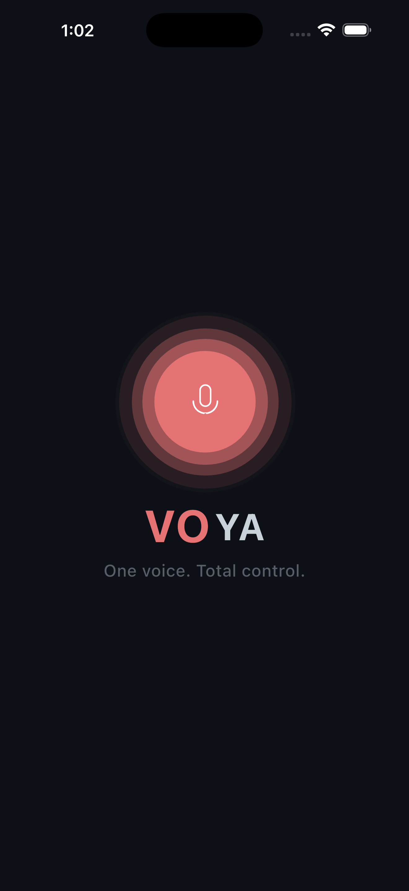 | 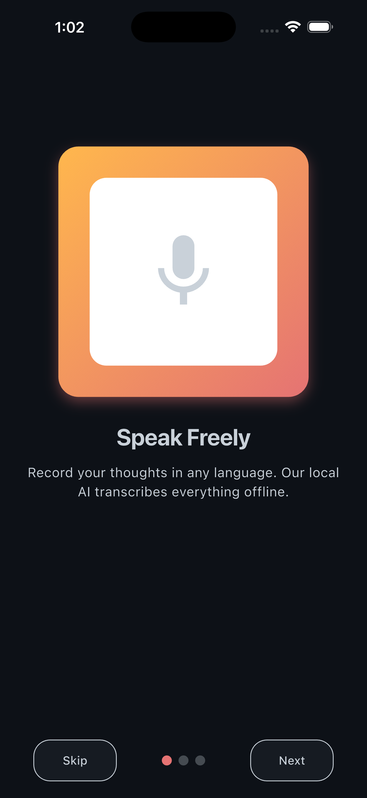 | 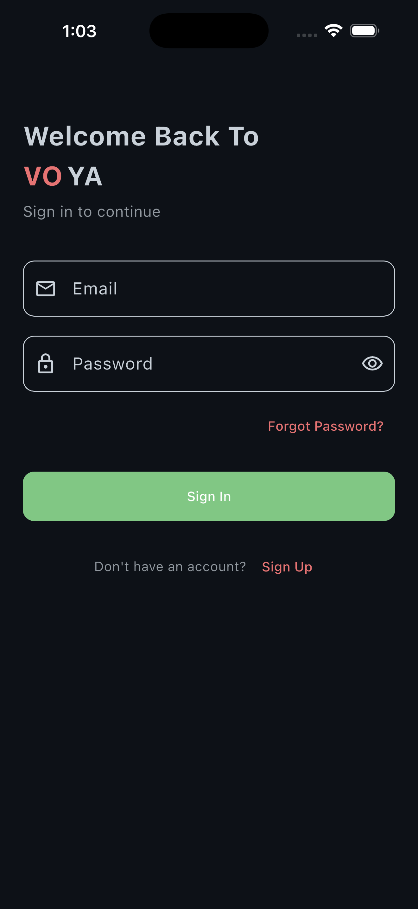 |

| Sign Up | Forgot Password | Home Screen |
|:-------:|:---------------:|:-----------:|
| 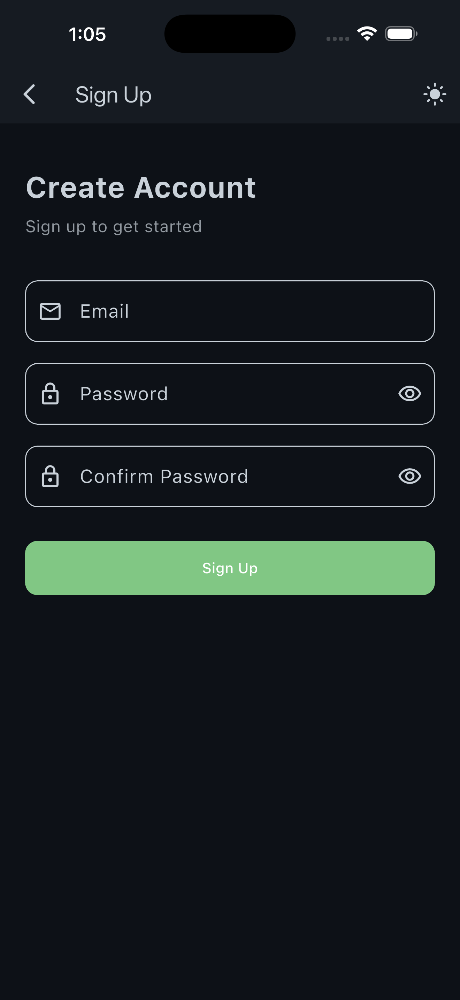 | 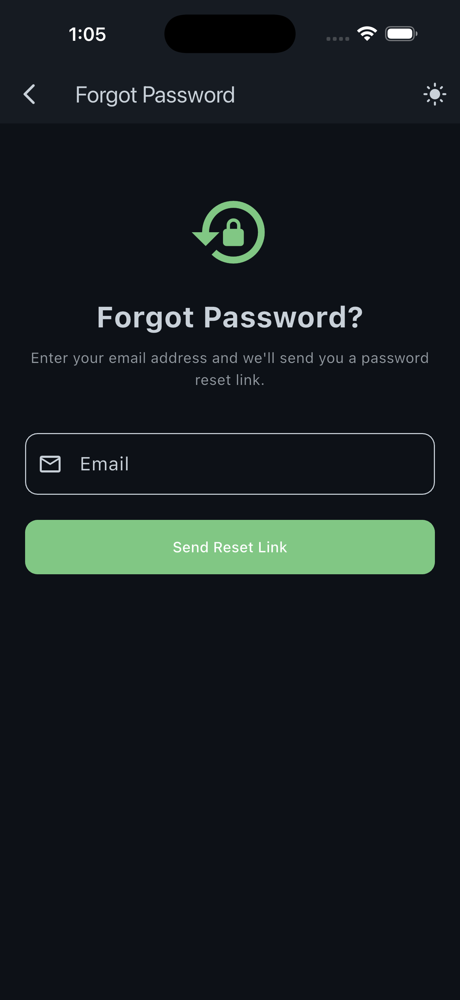 | 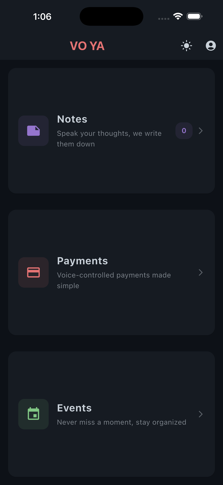 |

| Notes Screen | Note Detail | Recording Screen |
|:------------:|:-----------:|:----------------:|
| 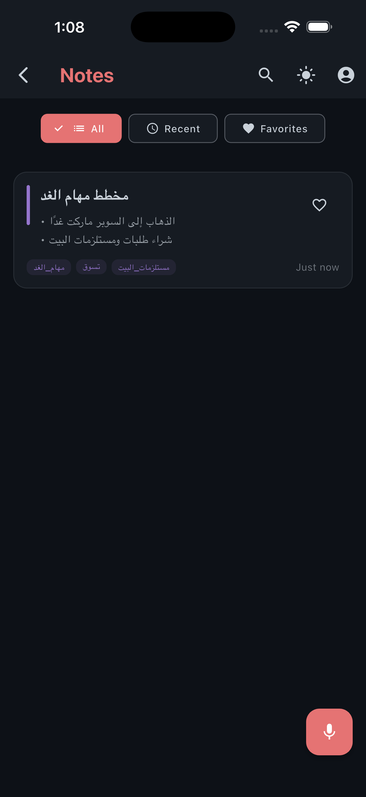 | 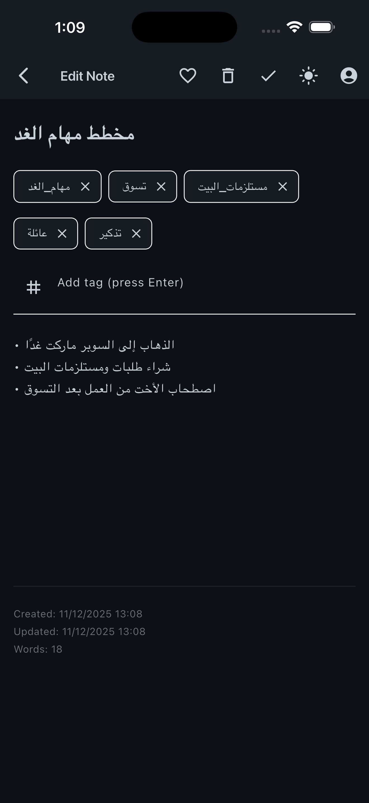 | 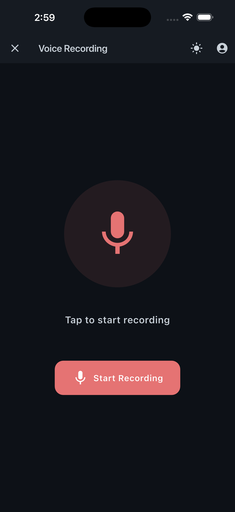 |

| Payments Screen | Payment Detail | Events Screen |
|:---------------:|:--------------:|:-------------:|
| 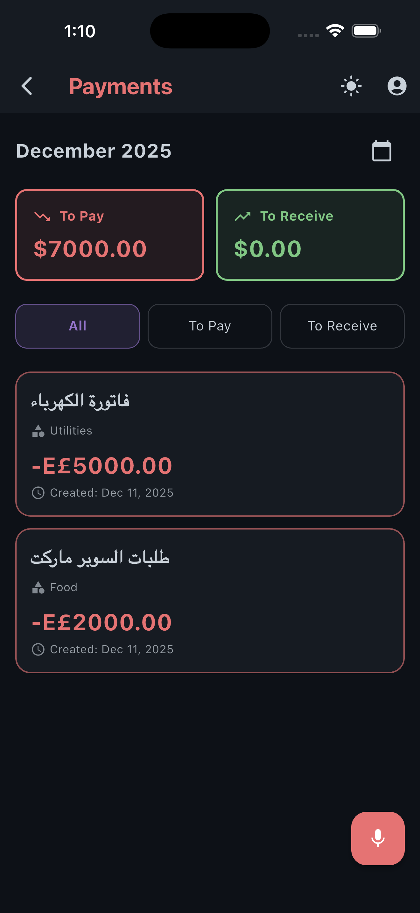 | 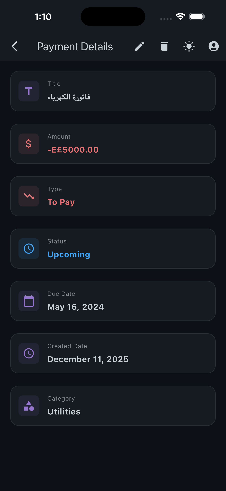 | 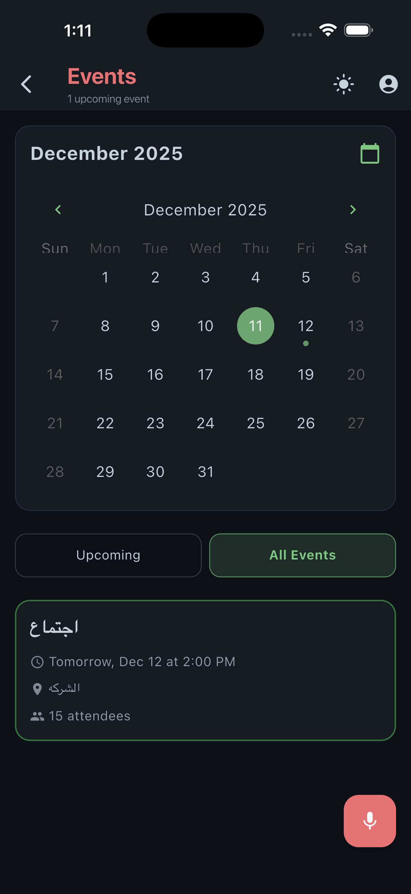 |

| Event Detail | Profile Screen |
|:------------:|:--------------:|
|  | 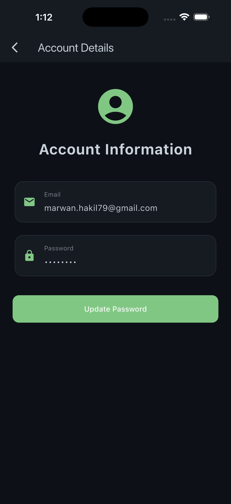 |

</div>

---

## 🛠️ Tech Stack

### **Frontend**
- **Flutter 3.9+** - Cross-platform UI framework
- **Dart 3.9+** - Programming language
- **flutter_bloc 9.1.1** - State management (BLoC pattern)
- **provider 6.1.5+1** - State management for theme
- **lottie 3.3.2** - Animations
- **table_calendar 3.1.2** - Calendar widget

### **Backend & Services**
- **Firebase** - Backend as a Service
  - **Firebase Authentication** - Email/password authentication
  - **Cloud Firestore** - Cloud database (optional, primarily uses local storage)
- **Google Cloud APIs**:
  - **Google Speech-to-Text API** - Audio transcription
  - **Google Gemini API** - AI-powered text processing
- **Service Account Authentication** - Secure API access

### **Local Storage**
- **Hive 2.2.3** - Fast NoSQL database
- **Hive Flutter 1.1.0** - Flutter integration
- **SharedPreferences 2.5.3** - Simple key-value storage

### **Architecture & Patterns**
- **BLoC Pattern** - Business Logic Component for state management
- **Clean Architecture** - Separation of concerns (Domain, Data, Presentation)
- **Repository Pattern** - Data abstraction layer
- **Dependency Injection** - Injectable & GetIt
- **Use Case Pattern** - Business logic encapsulation

### **Audio & Permissions**
- **record 5.2.1** - Audio recording
- **speech_to_text 7.0.0** - Local speech recognition (for language detection)
- **permission_handler 11.3.1** - Runtime permissions
- **just_audio 0.9.40** - Audio playback

### **Utilities**
- **injectable 2.7.0** - Dependency injection code generation
- **get_it 9.1.1** - Service locator
- **equatable 2.0.7** - Value equality
- **dartz 0.10.1** - Functional programming (Either type)
- **uuid 4.5.2** - Unique ID generation
- **intl 0.19.0** - Internationalization
- **http 1.6.0** - HTTP client
- **googleapis 15.0.0** - Google APIs client
- **googleapis_auth 2.0.0** - Google API authentication
- **google_generative_ai 0.4.0** - Gemini AI SDK

---

## 📁 Project Structure

```
vnote/
├── lib/
│   ├── core/
│   │   ├── auth/                    # Authentication logic
│   │   │   ├── entities/            # User entity
│   │   │   ├── exceptions/          # Auth exceptions
│   │   │   ├── repositories/        # Auth repository contract
│   │   │   └── usecases/            # Auth use cases
│   │   ├── constants/               # App constants
│   │   │   ├── app_colors.dart      # Color definitions
│   │   │   ├── app_strings.dart     # String constants
│   │   │   ├── app_typography.dart  # Typography styles
│   │   │   ├── currencies.dart      # Currency definitions
│   │   │   └── payment_categories.dart
│   │   ├── di/                      # Dependency Injection
│   │   │   ├── di.dart              # DI configuration
│   │   │   ├── di.config.dart       # Generated DI code
│   │   │   └── register_module.dart # External dependencies
│   │   ├── errors/                  # Error handling
│   │   │   ├── exceptions.dart      # Custom exceptions
│   │   │   └── failures.dart        # Domain failures
│   │   ├── services/                # Core services
│   │   │   ├── auth_service.dart
│   │   │   ├── data_migration_service.dart
│   │   │   └── onboarding_service.dart
│   │   ├── theme/                   # Theme configuration
│   │   │   ├── app_theme.dart       # Theme definitions
│   │   │   └── theme_provider.dart  # Theme state management
│   │   └── utils/                   # Utilities
│   │       └── page_transitions.dart
│   │
│   ├── data/
│   │   ├── auth/                    # Auth data layer
│   │   │   ├── datasources/         # Auth data sources
│   │   │   ├── models/              # Auth models
│   │   │   └── repositories/        # Auth repository implementation
│   │   ├── datasources_contracts/   # Data source interfaces
│   │   │   ├── google_speech_service.dart
│   │   │   ├── llm_datasource.dart
│   │   │   ├── transcription_datasource.dart
│   │   │   ├── payment_llm_datasource.dart
│   │   │   └── event_llm_datasource.dart
│   │   ├── datasource_impl/         # Data source implementations
│   │   │   ├── google_speech_service_impl.dart
│   │   │   ├── transcription_datasource_impl.dart
│   │   │   ├── llm_datasource_impl.dart
│   │   │   ├── payment_llm_datasource_impl.dart
│   │   │   └── event_llm_datasource_impl.dart
│   │   ├── models/                  # Data models (Hive adapters)
│   │   │   ├── note_model.dart
│   │   │   ├── payment_model.dart
│   │   │   └── event_model.dart
│   │   └── repositories/            # Repository implementations
│   │       ├── notes_repository_impl.dart
│   │       ├── payments_repository_impl.dart
│   │       ├── events_repository_impl.dart
│   │       └── audio_repository_impl.dart
│   │
│   ├── domain/
│   │   ├── entities/                # Domain entities
│   │   │   ├── note.dart
│   │   │   ├── payment.dart
│   │   │   ├── event.dart
│   │   │   ├── recording.dart
│   │   │   ├── processed_note.dart
│   │   │   ├── processed_payment.dart
│   │   │   └── processed_event.dart
│   │   ├── repositories/            # Repository contracts
│   │   │   ├── notes_repository.dart
│   │   │   ├── payments_repository.dart
│   │   │   ├── events_repository.dart
│   │   │   └── audio_repository.dart
│   │   └── usecases/                # Use cases
│   │       ├── notes/
│   │       ├── payments/
│   │       ├── events/
│   │       └── recording/
│   │
│   ├── presentation/
│   │   ├── auth/                    # Authentication UI
│   │   │   ├── cubit/               # Auth state management
│   │   │   ├── screens/              # Auth screens
│   │   │   └── widgets/             # Auth widgets
│   │   ├── cubit/                   # State management
│   │   │   ├── notes/
│   │   │   ├── payments/
│   │   │   ├── events/
│   │   │   └── recording/
│   │   ├── screens/                 # UI screens
│   │   │   ├── home_screen/
│   │   │   ├── notes/
│   │   │   ├── payments/
│   │   │   ├── events/
│   │   │   ├── recording/
│   │   │   ├── onboarding_screens/
│   │   │   ├── splash_screen/
│   │   │   └── permission/
│   │   └── widgets/                 # Reusable widgets
│   │
│   ├── firebase_options.dart        # Firebase configuration
│   └── main.dart                    # App entry point
│
├── assets/
│   ├── ScreenShots/                 # App screenshots
│   │   ├── Splash_Screen.png
│   │   ├── OnBoarding_Screen.png
│   │   ├── SignIn_Screen.png
│   │   ├── SignUp_Screen.png
│   │   ├── Forget_Password_Screen.png
│   │   ├── Home_Screen.png
│   │   ├── Notes_Screen.png
│   │   ├── Notes_Details_Screen.png
│   │   ├── Recording_Screen.png
│   │   ├── Payment_Screen.png
│   │   ├── Payment_Details_Screen.png
│   │   ├── Events_Screen.png
│   │   ├── Events_Details_Screen.png
│   │   └── Profile_Screen.png
│   └── splash_screen/               # Splash screen animations
│       ├── mic.json
│       └── voice.json
│
├── docs/                            # Comprehensive documentation
│   ├── auth_remote_datasource_impl.md
│   ├── auth_repository_impl.md
│   ├── firebase_options.md
│   ├── google_speech_service_impl.md
│   ├── transcription_datasource_impl.md
│   ├── llm_datasource_impl.md
│   ├── payment_llm_datasource_impl.md
│   └── event_llm_datasource_impl.md
│
├── assets/
│   ├── ScreenShots/                 # App screenshots
│   │   ├── Splash_Screen.png
│   │   ├── OnBoarding_Screen.png
│   │   ├── SignIn_Screen.png
│   │   ├── SignUp_Screen.png
│   │   ├── Forget_Password_Screen.png
│   │   ├── Home_Screen.png
│   │   ├── Notes_Screen.png
│   │   ├── Notes_Details_Screen.png
│   │   ├── Recording_Screen.png
│   │   ├── Payment_Screen.png
│   │   ├── Payment_Details_Screen.png
│   │   ├── Events_Screen.png
│   │   ├── Events_Details_Screen.png
│   │   └── Profile_Screen.png
│   └── splash_screen/               # Splash screen animations
│
├── test/                            # Unit & Widget Tests
├── pubspec.yaml                     # Dependencies
├── GOOGLE_APIS_DOCUMENTATION.md     # Google APIs guide
└── README.md                        # This file
```

---

## 🚀 Getting Started

### Prerequisites

- **Flutter SDK** (3.9.2 or higher)
- **Dart SDK** (3.9.2 or higher)
- **Android Studio / VS Code** with Flutter extensions
- **Firebase Account** (free tier available)
- **Google Cloud Account** (for Speech-to-Text and Gemini APIs)

### Installation

1. **Clone the repository**
   ```bash
   git clone <repository-url>
   cd vnote
   ```

2. **Install dependencies**
   ```bash
   flutter pub get
   ```

3. **Setup Firebase**
   
   - Create a new project on [Firebase Console](https://console.firebase.google.com)
   - Enable **Authentication** with Email/Password provider
   - Enable **Cloud Firestore** (optional, app primarily uses local storage)
   - Add your app (Android/iOS/Web) and download configuration files
   - Run FlutterFire CLI to generate `firebase_options.dart`:
     ```bash
     flutterfire configure
     ```

4. **Setup Google Cloud APIs**
   
   - Create a project on [Google Cloud Console](https://console.cloud.google.com)
   - Enable **Cloud Speech-to-Text API**
   - Enable **Generative AI API** (for Gemini)
   - Create a **Service Account**:
     - Go to IAM & Admin > Service Accounts
     - Create new service account
     - Grant "Cloud Speech-to-Text API User" and "Generative AI User" roles
     - Create JSON key and download
   - Place the JSON key in `assets/google_credentials.json`
   - Get your **Gemini API Key** from [Google AI Studio](https://aistudio.google.com/app/apikey)

5. **Configure API Keys**
   
   Update `lib/core/config/app_config.dart`:
   ```dart
   class AppConfig {
     static const String geminiApiKey = 'YOUR_GEMINI_API_KEY';
     static const String geminiModel = 'gemini-2.5-flash';
   }
   ```

6. **Update Assets**
   
   Ensure `pubspec.yaml` includes:
   ```yaml
   flutter:
     assets:
       - assets/splash_screen/
       - assets/google_credentials.json
   ```

7. **Run code generation**
   ```bash
   flutter pub run build_runner build --delete-conflicting-outputs
   ```

8. **Run the app**
   ```bash
   flutter run
   ```

### Platform-Specific Setup

#### Android
- Minimum SDK: 21
- Add microphone permission to `AndroidManifest.xml`:
  ```xml
  <uses-permission android:name="android.permission.RECORD_AUDIO" />
  ```

#### iOS
- Minimum iOS: 12.0
- Add microphone permission to `Info.plist`:
  ```xml
  <key>NSMicrophoneUsageDescription</key>
  <string>VOYA needs microphone access to record voice notes</string>
  ```

---

## 🏗️ Architecture

VOYA follows **Clean Architecture** principles with **BLoC pattern** for state management:

```
┌─────────────────────────────────────────┐
│      Presentation Layer                 │
│  (UI, Widgets, BLoC/Cubit)              │
│  - Screens, Widgets                     │
│  - State Management (BLoC)              │
│  - User Interactions                    │
└──────────────┬──────────────────────────┘
               │
┌──────────────▼──────────────────────────┐
│      Domain Layer                       │
│  (Business Logic)                       │
│  - Entities                             │
│  - Use Cases                            │
│  - Repository Contracts                 │
└──────────────┬──────────────────────────┘
               │
┌──────────────▼──────────────────────────┐
│      Data Layer                         │
│  (Data Sources & Repositories)          │
│  - Repository Implementations           │
│  - Data Sources (APIs, Local Storage)  │
│  - Models (Hive Adapters)               │
└──────────────┬──────────────────────────┘
               │
┌──────────────▼──────────────────────────┐
│      External Services                  │
│  - Firebase (Auth, Firestore)           │
│  - Google Speech-to-Text API            │
│  - Google Gemini API                    │
│  - Hive (Local Database)                │
└─────────────────────────────────────────┘
```

### Key Design Patterns

- **BLoC Pattern** - Separates business logic from UI
- **Repository Pattern** - Abstracts data sources
- **Dependency Injection** - Loose coupling, easy testing
- **Use Case Pattern** - Encapsulates business logic
- **Clean Architecture** - Separation of concerns across layers

### Data Flow Example: Voice Note Creation

1. **User Records Audio**
   - `RecordingCubit.startRecording()`
   - `StartRecordingUseCase`
   - `AudioRepository.startRecording()`
   - Audio saved locally

2. **User Stops Recording**
   - `RecordingCubit.stopRecording()`
   - `StopRecordingUseCase`
   - Creates `Recording` entity

3. **Transcribe Audio**
   - `TranscribeAudioUseCase`
   - `GoogleSpeechService.transcribeAudio()`
   - Google Speech-to-Text API
   - Returns transcription text

4. **Process with AI**
   - `ProcessTranscriptionUseCase`
   - `LLMDataSource.processTranscription()`
   - Google Gemini API
   - Returns `ProcessedNote` (title, bullets, tags, summary)

5. **Create Note**
   - `CreateNoteUseCase`
   - `NotesRepository.createNote()`
   - Saved to Hive database

---

## 📦 Dependencies

### Core Dependencies

```yaml
dependencies:
  flutter:
    sdk: flutter
  
  # State Management
  flutter_bloc: ^9.1.1
  provider: ^6.1.5+1
  
  # Firebase
  firebase_core: ^3.6.0
  firebase_auth: ^5.3.1
  cloud_firestore: ^5.4.4
  
  # Google APIs
  googleapis: ^15.0.0
  googleapis_auth: ^2.0.0
  google_generative_ai: ^0.4.0
  
  # Local Storage
  hive: ^2.2.3
  hive_flutter: ^1.1.0
  shared_preferences: ^2.5.3
  
  # Dependency Injection
  injectable: ^2.7.0
  get_it: ^9.1.1
  
  # Audio
  record: ^5.2.1
  speech_to_text: ^7.0.0
  just_audio: ^0.9.40
  
  # Utilities
  equatable: ^2.0.7
  dartz: ^0.10.1
  uuid: ^4.5.2
  intl: ^0.19.0
  permission_handler: ^11.3.1
  table_calendar: ^3.1.2
  lottie: ^3.3.2
  animated_splash_screen: ^1.3.0
  smooth_page_indicator: ^1.2.1
  font_awesome_flutter: ^10.12.0
  http: ^1.6.0

dev_dependencies:
  flutter_test:
    sdk: flutter
  build_runner: ^2.4.7
  injectable_generator: ^2.6.2
  hive_generator: ^2.0.1
  flutter_lints: ^5.0.0
```

---

## 📚 Documentation

Comprehensive documentation is available in the `docs/` directory:

### Firebase Services
- **[Firebase Authentication Data Source](docs/auth_remote_datasource_impl.md)** - Complete guide to Firebase Auth implementation
- **[Auth Repository](docs/auth_repository_impl.md)** - Clean Architecture pattern for authentication
- **[Firebase Options](docs/firebase_options.md)** - Platform-specific Firebase configuration

### Google API Services
- **[Google Speech-to-Text Service](docs/google_speech_service_impl.md)** - Audio transcription implementation
- **[Transcription Data Source](docs/transcription_datasource_impl.md)** - Multi-language transcription wrapper
- **[LLM Data Source (Notes)](docs/llm_datasource_impl.md)** - AI-powered note processing
- **[Payment LLM Data Source](docs/payment_llm_datasource_impl.md)** - Payment extraction from voice
- **[Event LLM Data Source](docs/event_llm_datasource_impl.md)** - Event extraction from voice

### Additional Documentation
- **[Google APIs Documentation](GOOGLE_APIS_DOCUMENTATION.md)** - Complete guide to Google Cloud APIs integration

Each documentation file includes:
- Detailed code walkthrough
- Design decisions and rationale
- Error handling strategies
- Configuration requirements
- Testing considerations
- Future improvements

---

## 🧪 Testing

```bash
# Run all tests
flutter test

# Run tests with coverage
flutter test --coverage

# Run specific test file
flutter test test/unit/auth_cubit_test.dart
```

### Testing Strategy

- **Unit Tests** - Test business logic (Use Cases, Repositories)
- **Widget Tests** - Test UI components
- **Integration Tests** - Test complete user flows
- **Mock Services** - Mock external APIs for testing

---

## 🤝 Contributing

We welcome contributions! Please follow these steps:

1. **Fork the repository**
2. **Create a feature branch**
   ```bash
   git checkout -b feature/amazing-feature
   ```
3. **Commit your changes**
   ```bash
   git commit -m 'Add some amazing feature'
   ```
4. **Push to the branch**
   ```bash
   git push origin feature/amazing-feature
   ```
5. **Open a Pull Request**

### Code Style

- Follow [Effective Dart](https://dart.dev/guides/language/effective-dart) guidelines
- Use meaningful variable and function names
- Add comments for complex logic
- Write tests for new features
- Follow Clean Architecture principles
- Use BLoC pattern for state management

---

## 📝 Roadmap

- [ ] **Offline AI Processing** - Local LLM for complete offline functionality
- [ ] **Voice Commands** - Natural language commands for app navigation
- [ ] **Export Features** - Export notes, payments, events to PDF/CSV
- [ ] **Cloud Sync** - Optional cloud backup with Firestore
- [ ] **Multi-Account Support** - Switch between multiple accounts
- [ ] **Advanced Search** - Full-text search with filters
- [ ] **Reminders & Notifications** - Push notifications for payments and events
- [ ] **Statistics & Analytics** - Spending trends, note frequency, etc.
- [ ] **Voice Templates** - Custom voice command templates
- [ ] **Collaboration** - Share notes and events with others
- [ ] **Dark Mode Enhancements** - More theme customization
- [ ] **Accessibility** - Screen reader support and accessibility features

---

## 🐛 Known Issues

- Google OAuth requires additional setup for iOS
- Some long transcriptions may take time to process
- Recurring payment/event calculations may need refinement for edge cases
- Large audio files (>10MB) require asynchronous processing

Please report issues on our [GitHub Issues](https://github.com/yourusername/voya/issues) page.

---

## 📄 License

This project is licensed under the **MIT License** - see the [LICENSE](LICENSE) file for details.

---

## 👨‍💻 Author

**Marwan**

- GitHub: [@Marwan1137](https://github.com/Marwan1137)
- Email: marwan.hakil79@gmail.com

---

## 🙏 Acknowledgments

- **Flutter Team** - For the amazing cross-platform framework
- **Firebase Team** - For the powerful backend platform
- **Google Cloud Team** - For Speech-to-Text and Gemini APIs
- **BLoC Community** - For excellent state management patterns
- **Open Source Contributors** - For their invaluable packages
- **Clean Architecture Community** - For architectural best practices

---

## 📞 Support

If you like this project, please consider:

- ⭐ **Starring the repository**
- 🐛 **Reporting bugs**
- 💡 **Suggesting new features**
- 🤝 **Contributing to the codebase**
- 📢 **Sharing with others**

---

<div align="center">

**Made with 🎤 and ❤️ for Productivity Enthusiasts**

[⬆ Back to Top](#-voya---your-voice-controlled-productivity-companion)

</div>
